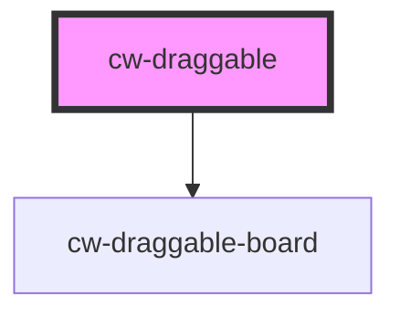

# cw-draggable

<!-- Auto Generated Below -->

## Properties

| Property         | Attribute         | Description | Type     | Default     |
| ---------------- | ----------------- | ----------- | -------- | ----------- |
| `bgColor`        | `bg-color`        |             | `string` | `undefined` |
| `border`         | `border`          |             | `string` | `undefined` |
| `gap`            | `gap`             |             | `string` | `undefined` |
| `height`         | `height`          |             | `string` | `undefined` |
| `itemTitle`      | `item-title`      |             | `string` | `undefined` |
| `itemsDirection` | `items-direction` |             | `string` | `undefined` |
| `transition`     | `transition`      |             | `string` | `undefined` |
| `width`          | `width`           |             | `string` | `undefined` |

## Dependencies

### Depends on

- [cw-draggable-board](./variants/board)

### Graph

----------------------------------------------

*Built with [StencilJS](https://stenciljs.com/)*
